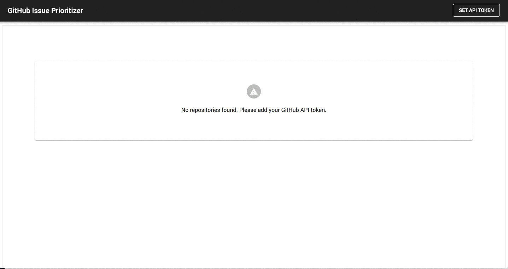

# GitHub Issue Prioritizer

This application is built using React, Redux, Thunk, React-Router, and the Material-UI component library. It also makes use of TypeScript to ensure type safety, which comes in handy when trying to identify and work with Redux action payloads. Proper typing adds an unbeatable level of static analysis which also makes refactoring less stressful because your IDE will automatically let you when you've made a mistake.

The app experience allows a user to view his/her GitHub repos and the issues associated with the given repo. The user can then also reorder the priority of the repo's issues via drag & drop.

### Local Storage

The application's state gets seralized to local storage for an ultra-quick user and developer experience.

### Remaining Work

Currently the priority set by the user is not persisted to a server-side store. Future work would allow the priority data structure (an array of issue ids) to be posted to an API endpoint and then retrieved in tandem with with the repo's GitHub issues.

On the data side, the app is currently tightly coupled to the API responses. If this were a more rapdily changing API, being so tightly coupled could present challenges for the frontend. One way to mitigate this would be to add an adapter layer which could be called after a service call resolves. In the adapter we could manipulate keys and or change data structures (i.e. normalize data like is being done in the issues reducer) for easier manipulation within the app. 

### Installing the app
`npm install`

### Starting up the app
`npm start`

### Testing the app
`npm run test`
